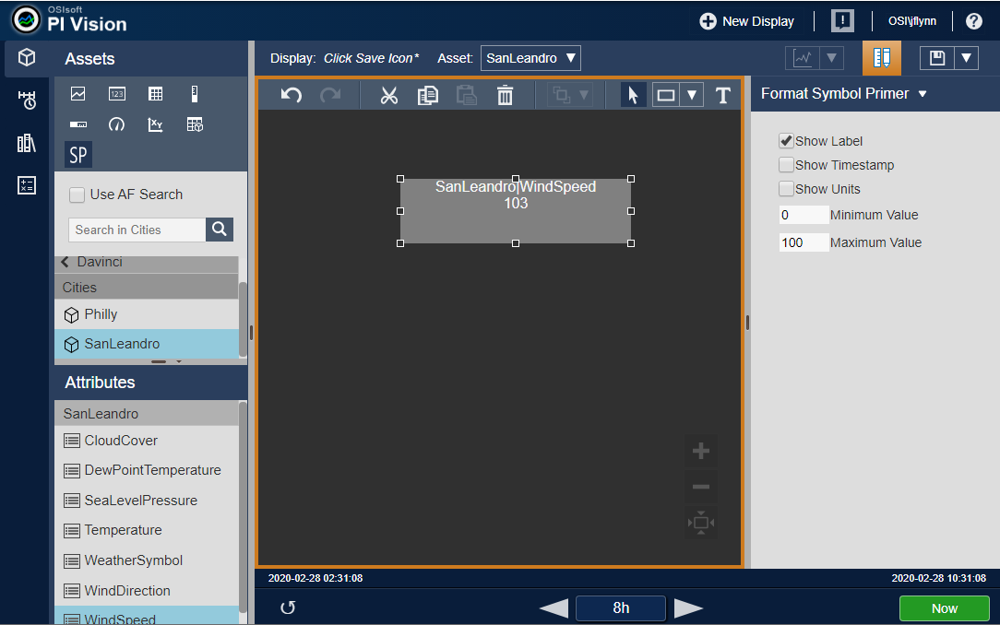

# Getting Started with PI Vision Extensibility

This document creates a simple PI Vision extensibility symbol. The symbol accepts a single tag or attribute and displays its value, label, timestamp, and units. The interesting thing about this symbol is that it changes its opacity based on the current value. The higher the value, the higher the opacity. In this way, a Process Engineer will only see data that is becoming an issue. Think of it as a multi-stated Value symbol that changes opacity as opposed to color. The goal of this document is to provide the user with a fully functional extensibility symbol framework that can be easily modified to create new symbols which meet the user&#39;s business requirements.

**Create the directory folders**

Ext Folder
Create the ext folder under:
PIVISION\_INSTALLATION\_FOLDER\Scripts\app\editor\symbols\_ext_

Icons Folder

Create the icons folder under:
PIVISION\_INSTALLATION\_FOLDER\Scripts\app\editor\symbols\_ext\icons_

**Create the symbol files**

Presentation layer

The Presentation layer controls what the user sees in PI Vision. The Presentation layer for a custom symbol is basic HTML with AngularJS for data and configuration binding.

Create the presentation HTML file for the symbol in the ext folder and name it sym-_symbolPrimer_-template.html. Note that the name is important. PI Vision automatically looks for customer symbols based on this naming convention.

Add the following content to the file:

\&lt;div class=&quot;SymbolPrimerLayout&quot; ng-style=&quot;{opacity: config.Opacity, background: config.BackgroundColor, color: MultistateColor || config.TextColor}&quot;\&gt;

    \&lt;div ng-show=&quot;config.ShowLabel&quot;\&gt;{{label}}\&lt;/div\&gt;
    
        \&lt;div\&gt;{{value}} \&lt;span ng-show=&quot;config.ShowUnits&quot;\&gt; {{Units}}\&lt;/span\&gt; \&lt;/div\&gt;
    
        \&lt;div ng-show=&quot;config.ShowTime&quot;\&gt;{{time}}\&lt;/div\&gt;

\&lt;/div\&gt;

Configuration layer

The Configuration layer, much like the presentation layer, is basic HTML with AngularJS for data binding and provides a way to configure the symbol&#39;s appearance.

Create the configuration HTML file for the symbol in the _ext_ folder and name it sym-_symbolPrimer_-config.html.

Add the following content to the file:

\&lt;div class=&quot;ConfigLayout&quot;\&gt;

    \&lt;label class=&quot;ConfigCheckBox&quot;\&gt;
    
        \&lt;input type=&quot;checkbox&quot; name=&quot;ShowLabel&quot; ng-model=&quot;config.ShowLabel&quot;\&gt;Show Label\&lt;br /\&gt;
    
    \&lt;/label\&gt;
    
    \&lt;label class=&quot;ConfigCheckBox&quot;\&gt;
    
        \&lt;input type=&quot;checkbox&quot; name=&quot;ShowTime&quot; ng-model=&quot;config.ShowTime&quot;\&gt;Show Timestamp\&lt;br /\&gt;
    
    \&lt;/label\&gt;
    
    \&lt;label class=&quot;ConfigCheckBox&quot;\&gt;
    
        \&lt;input type=&quot;checkbox&quot; name=&quot;ShowUnits&quot; ng-model=&quot;config.ShowUnits&quot;\&gt;Show Units\&lt;br /\&gt;
    
    \&lt;/label\&gt;
    
    \&lt;label class=&quot;ConfigText&quot;\&gt;
    
        \&lt;input class=&quot;ConfigTextBox&quot; type=&quot;text&quot; name=&quot;MinValue&quot; ng-model=&quot;config.MinValue&quot;\&gt;Minimum Value\&lt;br /\&gt;
    
    \&lt;/label\&gt;
    
    \&lt;label class=&quot;ConfigText&quot;\&gt;
    
        \&lt;input class=&quot;ConfigTextBox&quot; type=&quot;text&quot; name=&quot;MaxValue&quot; ng-model=&quot;config.MaxValue&quot;\&gt;Maximum Value\&lt;br /\&gt;
    
        \&lt;/label\&gt;

\&lt;/div\&gt;

Custom Style Sheet

The Custom Style Sheet (CSS) provides styling for the Presentation and Configuration layers.

Create the CSS file for the symbol in the _ext_ folder and name it sym-_symbolPrimer_.css.

Add the following content to the file:

.ConfigLayout {

    padding: 15px;
    
    font-size: 14px

}

.ConfigCheckBox {

    display: flex;
    
    align-items: center;
    
    margin-top: 8px;
    
    margin-left: 15px;
    
    font-size: 14px;

}

.ConfigText {

    display: flex;
    
    align-items: center;
    
    margin-top: 8px;
    
    margin-left: 15px;
    
    font-size: 14px;

}

.ConfigTextBox {

    width: 50px;

}

Symbol Icon

You can provide an icon to be added to the PI Vision symbol selector which appears in the Assets pane. A default symbol icon is used if this is not available. Use your preferred image editor to create a 512 x 512 pixel image with a transparent background. Save the image as sym-_symbolPrimer_.png. Copy the saved image into the

PIVISION\_INSTALLATION\_FOLDER\Scripts\app\editor\symbols\_ext\Icons_ folder.

Implementation Layer

The JavaScript implementation file has four parts: definition, registration, initialization, and event handlers.

Create a file to contain the symbol&#39;s implementation in the _ext_ folder and name it sym-_symbolPrimer_.js.

Add the following to the file, note that the file contents will be explained below:

 (function (PV) {

    &#39;use strict&#39;;
    
    function symbolPrimer() { }
    
    PV.deriveVisualizationFromBase(symbolPrimer);
    
    var definition = {
    
        typeName: &#39;symbolPrimer&#39;,
    
        datasourceBehavior: PV.Extensibility.Enums.DatasourceBehaviors.Single,
    
        iconUrl: &#39;scripts/app/editor/symbols/ext/icons/sym-symbolPrimer.png&#39;,
    
        supportsCollections: true,
    
        visObjectType: symbolPrimer,
    
        getDefaultConfig: function() {
    
               return {
    
                   DataShape: &#39;Value&#39;,
    
                   Height: 70,
    
                Width: 250,
    
                Opacity: &quot;1.0&quot;,
    
                BackgroundColor: &#39;grey&#39;,
    
                TextColor: &#39;white&#39;,
    
                ShowLabel: true,
    
                ShowTime: false,
    
                ShowUnits: false,
    
                MinValue: 0,
    
                MaxValue: 100
    
            };
    
        },
    
        configTitle: &#39;Format Symbol Primer&#39;,
    
        StateVariables: [&#39;MultistateColor&#39;]
    
    };
    
    symbolPrimer.prototype.init = function (scope, elem) {
    
        this.onDataUpdate = dataUpdate;
    
        this.onResize = symbolResize;
    
        this.onConfigChange = configChange;
    
        function dataUpdate(data) {
    
            if(data) {
    
                scope.value = data.Value;
    
                scope.config.Opacity = (data.Value - scope.config.MinValue) / (scope.config.MaxValue - scope.config.MinValue);
    
                scope.time = data.Time;
    
                if(data.Label) {
    
                    scope.label = data.Label;
    
                }
    
                if(data.Units) {
    
                    scope.Units = data.Units;
    
                }
    
            }
    
        }
    
        function symbolResize(width, height) {
    
            var SymbolContainer = elem.find(&#39;.SymbolPrimerLayout&#39;)[0];
    
            if(SymbolContainer) {
    
                SymbolContainer.style.width =  width + &#39;px&#39;;
    
                SymbolContainer.style.height =  height + &#39;px&#39;;
    
            }
    
        }
    
        function configChange(newConfig, oldConfig) {
    
            if (newConfig &amp;&amp; oldConfig &amp;&amp; !angular.equals(newConfig, oldConfig)) {
    
                if(!isNumeric(newConfig.MinValue) || !isNumeric(newConfig.MaxValue) || parseFloat(newConfig.MinValue) \&gt;= parseFloat(newConfig.MaxValue)) {
    
                    newConfig.MinValue = oldConfig.MinValue;
    
                    newConfig.MaxValue = oldConfig.MaxValue;
    
                }
    
            }
    
        }
    
        function isNumeric(n) {
    
            return n === &#39;&#39; || n === &#39;-&#39;  || !isNaN(parseFloat(n)) &amp;&amp; isFinite(n);
    
          }
    
    };
    
    PV.symbolCatalog.register(definition);

})(window.PIVisualization);

**A look at the code**

Symbol wrapper

The Implementation layer is wrapped in an immediately invoked function expression (IIFE). This function excepts a global PI Visualization object, which is passed in as a parameter.

 (function (PV) {

    &#39;use strict&#39;;
    
    function symbolPrimer() { }
    
    PV.deriveVisualizationFromBase(symbolPrimer);

})(window.PIVisualization);

Definition object

The definition property, shown below, is a JSON object (key-value pairs) that sets defaults for the symbol.

- typeName
This is the name of the symbol and will appear as a tooltip when the mouse is hovered over the symbol&#39;s icon.
- datasourceBehavior
Setting this property to Single allows you to drag and drop a single data item onto a display to create the symbol.
- getDefaultConfig
This property initializes the symbols default configuration. Updates to this property made by the configuration layer will be saved to the backend database. When a saved display is reopened it will be initialized with the saved configuration. Changes to this property should only be made by the configuration layer.
- DataShape
This parameter tells the application server the information that this symbol needs to represent the data.
  - Value – single value at a specific time
  - Gauge - includes the ratio of a value between a minimum and a maximum
  - Trend - multiple data source shape
  - Table - multiple data source shape, allows you to specify columns and sorting
- configTitle
This is the text for the configuration menu option that appears in the symbol&#39;s context (right-click) menu.
- StateVariables
Setting this to [&#39;MultistateColor&#39;] enables multi-state source configuration.
- supportsCollectons
Indicates whether the symbol can be included as part of a collection symbol.
- visObjectType
The name of the function that was extended from PV.deriveVisualizationFromBase.

    var definition = {
    
        typeName: &#39;symbolPrimer&#39;,
    
        datasourceBehavior: PV.Extensibility.Enums.DatasourceBehaviors.Single,
    
        supportsCollections: true,
    
        visObjectType: symbolPrimer,
    
        getDefaultConfig: function() {
    
               return {
    
                   DataShape: &#39;Value&#39;,
    
                   Height: 70,
    
                Width: 250,
    
                Opacity: &quot;1.0&quot;,
    
                BackgroundColor: &#39;grey&#39;,
    
                TextColor: &#39;white&#39;,
    
                ShowLabel: true,
    
                ShowTime: false,
    
                ShowUnits: false,
    
                MinValue: 0,
    
                MaxValue: 100
    
            };
    
        },
    
        configTitle: &#39;Format Symbol Primer&#39;,
    
        StateVariables: [&#39;MultistateColor&#39;]
    
    };

Initialization function

The Initialization function is used to set callback functions for the symbol which drive the symbol&#39;s behavior. The function accepts scope and element parameters.

- scope
Provides access to PI Vision variables available to the symbol.
- elem
Provides access to the HTML DOM element of the symbol&#39;s presentation layer.

    symbolPrimer.prototype.init = function (scope, elem) {

    };

Callback functions

The symbol defined in this document defines callback functions to handle data update, resize, and configuration change events.

        this.onDataUpdate = dataUpdate;
    
        this.onResize = symbolResize;
    
        this.onConfigChange = configChange;

onDataUpdate callback

This function is called by the PI Vision infrastructure any time a data update occurs. The properties on the object returned are determined by the DataShape specified in the getDefaultConfig function.

- Infrequently changed metadata values such as label, units, and path are contained in the first callback invocation and intermittently thereafter. The code checks to see if the label and units were provided prior to using them.
- The primer symbol sets the opacity for the presentation layer based on the data value and the configured minimum/maximum. Note that the PI Web API can be used to obtain the min and max data item values.

function dataUpdate(data) {

   if(data) {

     scope.value = data.Value;
    
     scope.config.Opacity = (data.Value - scope.config.MinValue) / (scope.config.MaxValue - scope.config.MinValue);
    
     scope.time = data.Time;
    
     if(data.Label) {
    
        scope.label = data.Label;
    
     }
    
     if(data.Units) {
    
        scope.Units = data.Units;
    
     }

   }

}

onResize callback

This function is called by the PI Vision infrastructure when the symbol is resized.

- The HTML DOM element, elem, passed into the Initialization function by PI Vision, for the symbol is used to find the symbol&#39;s container and then the container is resized.

function symbolResize(width, height) {

   var SymbolContainer = elem.find(&#39;.SymbolPrimerLayout&#39;)[0];

   if(SymbolContainer) {

      SymbolContainer.style.width =  width + &#39;px&#39;;
    
      SymbolContainer.style.height =  height + &#39;px&#39;;

   }

}

onConfigChange callback

This function is called by the PI Vision infrastructure anytime the configuration of a symbol is updated by the user in the Configuration layer.

- The primer symbol uses this callback to validate the minimum and maximum values provided by the user in the Configuration pane.

function configChange(newConfig, oldConfig) {

   if (newConfig &amp;&amp; oldConfig &amp;&amp; !angular.equals(newConfig, oldConfig)) {

      if(!isNumeric(newConfig.MinValue) || !isNumeric(newConfig.MaxValue) || parseFloat(newConfig.MinValue) \&gt;=   parseFloat(newConfig.MaxValue)) {
    
                    newConfig.MinValue = oldConfig.MinValue;
    
                    newConfig.MaxValue = oldConfig.MaxValue;
    
      }

   }

}

function isNumeric(n) {

   return n === &#39;&#39; || n === &#39;-&#39;  || !isNaN(parseFloat(n)) &amp;&amp; isFinite(n);

}

The symbol in PI Vision

We created an  icon for the symbol primer. This icon is displayed by PI Vision in the Assets tool panel.

To use the symbol:

-
Click the  icon
 icon
- Navigate to an attribute with a numeric value
- Drag the attribute onto the display panel
- To display the configuration panel
  - Right-click on the symbol to display the popup context menu
  - Click the &quot;Format Symbol Primer&quot; menu option

 

Addendum

PI Web API Http request example

To make a HTTP request from a custom symbol, you will need to use an AngularJS $http provider. The following example uses the $http provider to get the available AF servers. Depending on your CORS (Cross-Origin Resource Sharing) configuration you may need to start Chrome with the --disable-web-security flag (debug testing only).

- Inject a &#39;$http&#39; provider string into symbol definition

var definition = {

inject: [&#39;$http&#39;],

};

- Pass the $http provider as a parameter to the Initialization function

    symbolPrimer.prototype.init = function (scope, elem, $http) {

    };

- Make a GET HTTP request for the list of all available asset servers and output results to the console.

    symbolPrimer.prototype.init = function (scope, elem, $http) {

       var baseUrl = PV.ClientSettings.PIWebAPIUrl;

       $http.get(baseUrl + &#39;/assetservers&#39;).then(function (response) { console.log(response); });

    };
